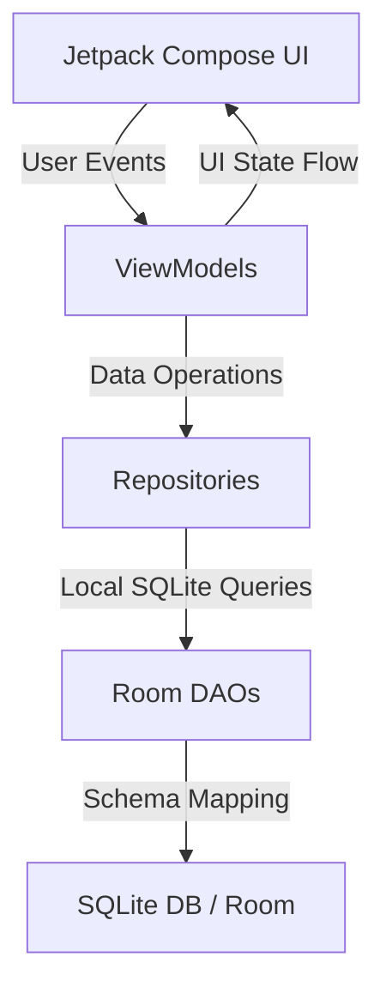

# expenseIt Architecture Document 🏗️

This document describes the architectural patterns, database schemas, and data flow of **expenseIt**.

---

## 🏛️ Layered Architecture (MVVM)

The application follows the clean, unidirectional data flow (UDF) recommended by Android Jetpack.

### 1. Presentation Layer (UI)
* Built entirely in **Jetpack Compose**.
* Screens are stateful composables observing the ViewModel's exposed state via Kotlin `StateFlow`.
* Navigation is routed via `ParooNavGraph.kt` utilizing the Compose Navigation Library.

### 2. ViewModel Layer
* ViewModel classes extend `androidx.lifecycle.ViewModel`.
* Handles UI events, performs formatting, and calls repositories inside Kotlin Coroutines (`viewModelScope`).
* Exposes read-only UI state using `StateFlow<UiState>`.

### 3. Data Layer (Repositories & DAOs)
* **Repositories**: Act as the single source of truth, orchestrating data between local databases and network interfaces.
* **DAOs (Data Access Objects)**: Execute native SQLite queries mapped to Kotlin data classes.
* **Room Database**: Local SQL persistence layer using minor currency units (paise) to prevent floating-point accuracy issues.

---

## 🗄️ Database Schema & Relationships

The database is built on **Room** with the following entity tables:

### 1. Personal Expense Tracker
* **`transactions`**: Stores personal transactions.
  * Columns: `id` (PK), `amountMinor` (Long, paise), `currency` (String), `merchant` (String), `description` (String), `category` (String), `txnDate` (Long), `createdAt` (Long)

### 2. Group Bill Splitter
* **`friends`**: Contacts added for splitting bills.
  * Columns: `id` (PK), `name` (String), `phone` (String), `createdAt` (Long)
* **`groups`**: Expense groups created by the user.
  * Columns: `id` (PK), `name` (String), `createdAt` (Long)
* **`group_members`**: Junction table mapping friends to groups.
  * Columns: `id` (PK), `groupId` (FK), `friendId` (FK), `isCurrentUser` (Boolean)
* **`group_expenses`**: Recorded group expenses.
  * Columns: `id` (PK), `groupId` (FK), `description` (String), `amountMinor` (Long), `paidByMemberId` (FK), `splitType` (String), `category` (String), `txnDate` (Long), `createdAt` (Long)
* **`expense_splits`**: Split breakdown for a group expense.
  * Columns: `id` (PK), `expenseId` (FK), `memberId` (FK), `shareMinor` (Long)
* **`settlements`**: Records of repayments between members.
  * Columns: `id` (PK), `groupId` (FK), `fromMemberId` (FK), `toMemberId` (FK), `amountMinor` (Long), `createdAt` (Long)

---

## 🎨 Theme & State Flow

* The application theme selection is stored persistently in `SharedPreferences` as an integer:
  * `0`: Follow System Theme
  * `1`: Light Theme
  * `2`: Dark Theme
* `MainActivity.kt` monitors theme mode changes dynamically and triggers a recomposition of the global `MyApplicationTheme` wrapper.
